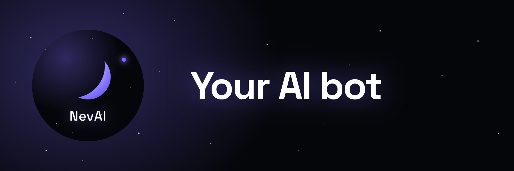
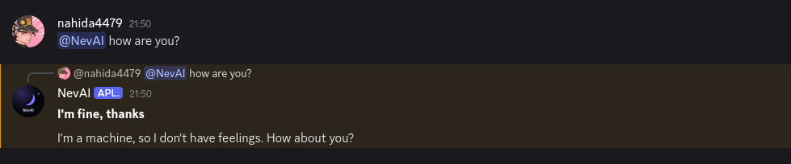

# NevAI

<a href="https://discord.com/invite/CttU24eg3F">
    
</a>

**A Discord bot that lets admins set an AI channel per server, mention it and it responds using free AI models, remembering the last 15 messages for context.**

# Features

- Only the Discord server administrator can use `/ai`, `/ai_settings`, `/language`, and `/logs`.
- The bot responds using the AI models listed below.
- The bot supports vision models (image understanding).
- Responses are limited to 1500 characters.
- Pre-built Docker image available.
- Custom success and error emoji.
- The bot reacts with an emoji when responding in a Discord chat.
- The server administrator can set a custom AI prompt.
- Multi-language support ([add your own language](./CONTRIBUTING.md)).
- The bot saves the last 15 messages for chat context.
- Live logs support (`/logs` command).
- The bot can use custom Discord server emoji.
- Responds using `Exa.ai`.

# How to use?
1. [Add bot](https://discord.com/oauth2/authorize?client_id=1544417524613910628&permissions=8&integration_type=0&scope=bot) and set the AI channel using the `/ai` command.
2. Mention the bot, then ask your question.



3. 

# AI models list (only free models)

**Gemini**
```yaml
gemini-2.5-flash
gemini-2.5-flash-lite
```

**Groq**
```yaml
openai/gpt-oss-120b 
openai/gpt-oss-20b
```

**HackClub**
```yaml
meta-llama/llama-3.3-70b-instruct
```

**Openrouter**
```yaml
Free models (openrouter/free)
```

---

## Models for vision

**Groq**
```yaml
qwen/qwen3.6-27b 
qwen/qwen3.8-27b
```

## Models web search ([Exa.ai](https://exa.ai/))

The model decides for itself whether it wants to use Exa.ai. When the model uses Exa.ai, information from the internet is returned. The model uses this information to respond in the Discord chat. When the model decides it doesn’t need to use Exa.ai, it won’t. If you don’t add an EXA_API token, the bot will continue to function, but it will not search for information on the web.

# Administrator commands

| **Commands** | **Description** |
|---|---|
| `/ai` | Set the channel where the AI will respond to mentions.|
| `/ai_settings` | Open the settings panel to customize the AI prompt and reaction emoji. |
| `/language` | Change the bot's response language. |
| `/logs` | Set the channel where AI response logs will be sent. |
| `/help` | List of commands in embed format |


# Requirements

### API
**Minimum 1 of the listed AI APIs:**


 [Groq API](https://console.groq.com/keys) **|**
 [Gemini API](https://aistudio.google.com/api-keys) **|**
 [HackClub API](https://ai.hackclub.com/keys) **|**
 [OpenRouter](https://openrouter.ai)


You'll also need a [Discord Application](https://discord.com/developers/applications) to get __your bot token__ and optionally an [Exa.ai](https://exa.ai/) API key (so the models can search for information on the internet).


## Env

```bash
GROQ_API=
GEMINI_API=
HACKCLUB_API=
OPENROUTER_API=
EXA_API=
DISCORD_API=
DEBUG_MODE= #true/false
```

# Running

## Docker
1. Create `.env` file

```dockerfile
docker pull ghcr.io/nahida4479/nevai:latest
docker run --env-file .env ghcr.io/nahida4479/nevai:latest 
```

## Running without Docker

```bash
git clone https://github.com/Nahida4479/NevAI-Bot.git
cd NevAI-Bot
npm install
nano .env 
node bot.js
```

# License 
[**MIT LICENSE**](./LICENSE)