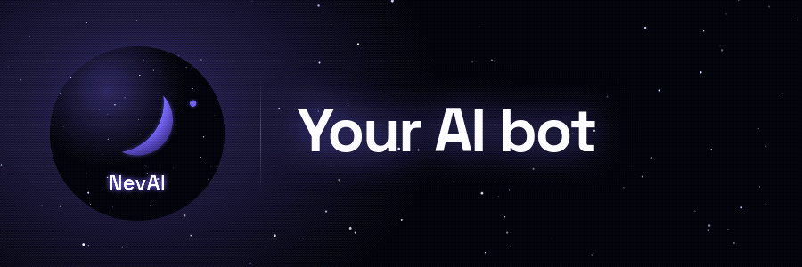
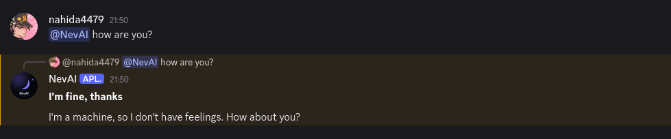

# NevAI
<a href="https://discord.com/invite/CttU24eg3F">
    
</a>


<p align="center" style="text-align: center; font-weight: bold;">A Discord bot that lets admins set an AI channel per server, mention it and it responds using free AI models and Exa.ai (optional), remembering the last 15 messages for context.</p>

<div align="center">

<a href="https://discord.com/oauth2/authorize?client_id=1544417524613910628&permissions=17179995200&integration_type=0&scope=bot"></a>

<a href="./LICENSE"></a>

<a href="https://discord.com/invite/CttU24eg3F"></a>
</div>

# Features

- Only the Discord server administrator can use `/ai`, `/ai_settings`, `/language`, and `/logs`.
- The bot responds using the AI models listed below.
- The bot supports vision models (image understanding).
- Responses are limited to 1500 characters.
- Pre-built Docker image available.
- Custom success and error emoji.
- The bot reacts with an emoji when responding in a Discord chat.
- The server administrator can set a custom AI prompt.
- Multi-language support ([add your own language](./CONTRIBUTING.md)).
- The bot saves the last 15 messages for chat context.
- Live logs support (`/logs` command).
- The bot can use custom Discord server emoji.
- Responds using `Exa.ai`.

# How to use?
1. [Add bot](https://discord.com/oauth2/authorize?client_id=1544417524613910628&permissions=17179995200&integration_type=0&scope=bot) and set the AI channel using the `/ai` command.
2. Mention the bot, then ask your question.



3. You can customize the bot's options using [administrator commands](#administrator-commands) (server administrator only).

# AI models list (free models)

**Gemini**
```yaml
gemini-2.5-flash
gemini-2.5-flash-lite
```

**Groq**
```yaml
openai/gpt-oss-120b 
openai/gpt-oss-20b
```

**HackClub**
```yaml
openai/gpt-6-luna
```

**Openrouter**
```yaml
Free models (openrouter/free)
```

---

# AI models list (paid models)

**Anthropic**
```yaml
Claude Haiku 5.5
```

---

## Models for vision

**Groq**
```yaml
qwen/qwen3.6-27b 
qwen/qwen3.8-27b
```
> [!WARNING]
> The model list may change at any time. Free models can be renamed, limited or removed by their providers.
## Models web search ([Exa.ai](https://exa.ai/))

The model decides for itself whether it wants to use Exa.ai. When the model uses Exa.ai, information from the internet is returned. The model uses this information to respond in the Discord chat. When the model decides it doesn’t need to use Exa.ai, it won’t. If you don’t add an EXA_API token, the bot will continue to function, but it will not search for information on the web. Exa returns images too.

# Administrator commands

| **Commands** | **Description** |
|---|---|
| `/ai` | Set the channel where the AI will respond to mentions.|
| `/ai_settings` | Open the settings panel to customize the AI prompt and reaction emoji. |
| `/language` | Change the bot's response language. |
| `/logs` | Set the channel where AI response logs will be sent. |
| `/help` | List of commands in embed format |


# Requirements

#### Minimum 1 of the listed AI APIs:

 [Groq API](https://console.groq.com/keys) **|**
 [Gemini API](https://aistudio.google.com/api-keys) **|**
 [HackClub API](https://ai.hackclub.com/keys) **|**
 [OpenRouter](https://openrouter.ai) **|**
 [Anthropic](https://platform.claude.com)

You'll also need a [Discord Application](https://discord.com/developers/applications) to get __your bot token__ and optionally an [Exa.ai](https://exa.ai/) API key (so the models can search for information on the internet).


## Env

```bash
GROQ_API=
GEMINI_API=
HACKCLUB_API=
OPENROUTER_API=
EXA_API=
DISCORD_API=
ANTHROPIC_API=
DEBUG_MODE= #true/false
```

> [!NOTE]
> `DEBUG_MODE` adds an advanced logging option to the `debug.log` file.


# Running

## Docker with install.sh

```bash
curl -sSL https://raw.githubusercontent.com/Nahida4479/NevAI-Bot/main/install/install.sh | bash
```

## Docker manual (no automatic updates)

```bash
mkdir NevAI
cd NevAI
curl -fsSL -o .env https://raw.githubusercontent.com/Nahida4479/NevAI-Bot/main/example/env.example 
nano .env
chmod 600 .env
touch data.json
docker run -d --env-file .env -v $(pwd)/data.json:/NevAI/data.json --name nevai --restart unless-stopped ghcr.io/nahida4479/nevai:latest
```

# License 
Released under the [MIT License](./LICENSE) © 2026 [Nahida4479](https://github.com/Nahida4479).
Free to use, modify and share, as long as the license notice is kept. Provided "as is", without warranty.